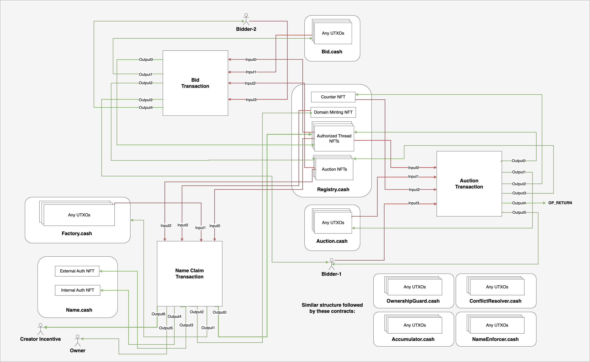
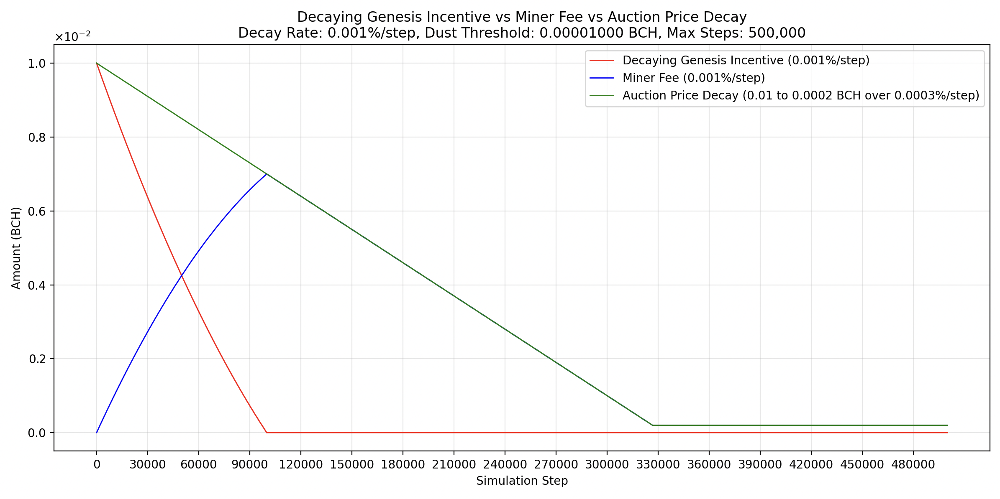

# @bitcann/contracts

Bitcoin Cash for Assigned Names and Numbers (BitCANN) Smart Contracts

<p align="center">
  <a href="https://www.npmjs.com/package/@bitcann/contracts"></a>
  <a href="https://codecov.io/github/BitCANN/bitcann-contracts" > 
  
 </a><br>
  <a href="https://t.me/bitcann_protocol"></a>
  <a href="https://www.npmjs.com/package/@bitcann/contracts"></a>
</p>

> ⚠️ Important Notice: The contracts have not undergone extensive auditing by third parties. Users should be aware of potential risks, including the possibility of losing domain ownership or funds during auctions. Exercise caution and consider these risks before use.**


## Installation

```bash
npm install @bitcann/contracts
```

## Usage

```javascript
import { BitCANNArtifacts } from '@bitcann/contracts';

// Access contract artifacts
const { Registry, Auction, Domain } = BitCANNArtifacts;
```

---

# Documentation

BitCANN - **Bitcoin Cash for Assigned Names and Numbers** – is a decentralized domain name and identity system built on the Bitcoin Cash Blockchain.

- Decentralized Domain Names like `.sat` and `.bch` and more.
- Add Records, RPA Pay Codes, Add Currency Addresses, Text Records, Custom Records, Social, Email, and more.
- No Renewals or Expiry*
- NFT Domain ownership, enabling secondary market trading.
- Easy lookups
- Sign-In using your Identity
- Plugin for other contract systems
- Earn by protecting the system by:
   - Burning illegal registration attempts
   - Identifying and burning registration conflicts
   - Proving domain violations

## Table of Contents
1. [Contracts](#contracts)
   - [Registry](#registry)
   - [Operational Contracts](#operational-contracts)
      - [Auction](#auction)
      - [Bid](#bid)
      - [DomainFactory](#domainfactory)
   - [Guard Contracts](#guard-contracts)
      - [AuctionNameEnforcer](#auctionnameenforcer)
      - [DomainOwnershipGuard](#domainownershipguard)
      - [AuctionConflictResolver](#auctionconflictresolver)
   - [Domain](#domain)
   - [Accumulator](#accumulator)
2. [Cashtokens](#cashtokens)
   - [RegistrationNFTs](#registrationnfts)
   - [AuctionNFT](#auctionnft)
   - [AuthorizedThreadNFTs](#authorizedthreadnfts)
   - [DomainNFTs](#domainnfts)
3. [TLDs](#tlds)
4. [Genesis](#genesis)
5. [Dual Decay Mechanism](#dual-decay-mechanism)
6. [FAQs](#faqs)
   - [How are names allocated or sold?](#how-are-names-allocated-or-sold)
   - [Can a bid be cancelled?](#can-a-bid-be-cancelled)
   - [How is any TLD assigned?](#how-is-any-tld-assigned)
   - [Who earns from the auction sales?](#who-earns-from-the-auction-sales)
   - [Can anyone renounce ownership of a domain?](#can-anyone-renounce-ownership-of-a-domain)
   - [What occurs during a ownership renouncement event?](#what-occurs-during-a-ownership-renouncement-event)
   - [How does ownership transfer work?](#how-does-ownership-transfer-work)
   - [How to records managed?](#how-to-records-managed)
   - [No Renewal or Expiry?](#no-renewal-or-expiry)
   - [Why use text-based ownership instead of hash-based ownership?](#why-use-text-based-ownership-instead-of-hash-based-ownership)
   - [How do I know I or someone else owns a domain?](#how-do-i-know-i-or-someone-else-owns-a-domain)
   - [What if the incentive system is not 100% effective?](#what-if-the-incentive-system-is-not-100-effective)
   - [What if an invalid name is registered?](#what-if-an-invalid-name-is-registered)

## Contracts



The architecture is built around a series of smart contracts, categorized into these main types:

- **Registry Contract**: [Registry.cash](#registry)

- **Operational Contracts**: [Auction.cash](#auction), [Bid.cash](#bid), [DomainFactory.cash](#domainfactory)

- **Guard Contracts**: [AuctionNameEnforcer.cash](#auctionnameenforcer), [DomainOwnershipGuard.cash](#domainownershipguard), [AuctionConflictResolver.cash](#auctionconflictresolver)

- **Domain Contract**: [Domain.cash](#domain)

- **Accumulator Contract**: [Accumulator.cash](#accumulator)


### Registry

The Registry contract functions as the control and storage hub. Operational, Guard, and Accumulator contracts must execute their transactions in conjunction with the Registry contract.
This contract holds [RegistrationNFTs](#registrationnfts), [AuctionNFTs](#auctionnft), and [AuthorizedThreadNFTs](#authorizedthreadnfts).

Constructor:
- `domainCategory`: The category of the domain. All the NFTs in the system belong to this category.

Transaction Structure:
| # | Inputs | Outputs |
|---|--------|---------|
| 0 | [AuthorizedThreadNFT](#authorizedthreadnfts) NFT with authorized contract's locking bytecode as commitment from self | [AuthorizedThreadNFT](#authorizedthreadnfts) back to self + (optionally tokenAmount from auctionNFT input) |
| 1 | Any UTXO from Authorized contract | UTXO back to Authorized contract |

> **Note:** The actual number and structure of inputs/outputs and covenants beyond this pair is controlled by the authorized contract being used.

### Operational Contracts

#### Auction

The Auction contract lets anyone start a new auction.
Each auction requires:
   - A minimum starting bid of at least `minStartingBid` BCH.
   - It runs for at least `minWaitTime`(check [DomainFactory](#domainfactory) contract). The timer resets with a new bid.

Constructor:
- `minStartingBid`: The minimum starting bid of the auction.

Transaction Structure:

Parameters:
- `name`: The name of the domain. This does not include the TLD. [TLDs](#tlds)

| # | Inputs | Outputs |
|---|--------|---------|
| 0 | [AuthorizedThreadNFT](#authorizedthreadnfts) NFT with authorized contract's locking bytecode as commitment from [Registry Contract](#registry) | [AuthorizedThreadNFT](#authorizedthreadnfts) back to [Registry Contract](#registry) |
| 1 | Any UTXO from self | Back to self |
| 2 | [RegistrationNFTs](#registrationnfts) Counter NFT | [RegistrationNFTs](#registrationnfts) Counter NFT, with nftCommitment incremented by 1 and tokenAmount decreased by NewRegistrationID |
| 3 | Funding UTXO from bidder | [AuctionNFT](#auctionnft) |
| 4 | | OP_RETURN revealing the name |
| 5 | | Optional change in BCH |


#### Bid

The Bid contract allows anyone to bid on an active auction by allowing restricted manipulation of auctionNFT. It updates the `satoshisValue` and the `pkh` in the `nftCommitment`. The only condition is that the new Bid amount must be at least `minBidIncreasePercentage` higher. Even if the auction is passed the `minWaitTime` and the winning bid has not claimed the domain's ownership, it's still possible to continue bidding which will reset the timer to atleast `minWaitTime`.

Constructor:
- `minBidIncreasePercentage`: The minimum percentage increase in the new bid amount.

Transaction Structure:
| # | Inputs | Outputs |
|---|--------|---------|
| 0 | [AuthorizedThreadNFT](#authorizedthreadnfts) NFT with authorized contract's locking bytecode as commitment from [Registry Contract](#registry) | [AuthorizedThreadNFT](#authorizedthreadnfts) back to [Registry Contract](#registry) |
| 1 | Any UTXO from Authorized contract | UTXO back to Authorized contract |
| 2 | [AuctionNFT](#auctionnft) | [AuctionNFT](#auctionnft) with increased amount and updated commitment |
| 3 | Funding UTXO from new bidder | Previous bid amount returned to previous bidder |
| 4 | | Optional change to new bidder |


#### DomainFactory

The DomainFactory burns the auctionNFT and issues 3 new NFTs [DomainNFTs](#domainnfts). It verifies that the actionNFT input is at least `minWaitTime` old. It also attaches the tokenAmount from auctionNFT to the authorized contract's thread.

Constructor:
- `domainContractBytecode`: The partial bytecode of the domain contract.
- `minWaitTime`: The minimum wait time after which the domain can be claimed by the bidder.
- `maxPlatformFeePercentage`: The maximum fee percentage that can be charged by the platform.

Transaction Structure:
| # | Inputs | Outputs |
|---|--------|---------|
| 0 | [AuthorizedThreadNFT](#authorizedthreadnfts) NFT with authorized contract's locking bytecode as commitment from [Registry Contract](#registry) | [AuthorizedThreadNFT](#authorizedthreadnfts) back to [Registry Contract](#registry) + tokenAmount from auctionNFT input|
| 1 | Any UTXO from self | Back to self |
| 2 | [RegistrationNFT](#registrationnfts) Domain Minting NFT | [RegistrationNFT](#registrationnfts) Domain Minting NFT back to registry contract |
| 3 | [AuctionNFT](#auctionnft) | [DomainNFT](#domainnfts) External Auth NFT |
| 4 | Pure BCH from bidder | [DomainNFT](#domainnfts) Internal Auth NFT |
| 5 | | [DomainNFT](#domainnfts) Ownership NFT |
| 6 | | Pure BCH back to Bidder |
| 7 | | Platform fee and rest to miners |


### Guard Contracts

These contracts serve the purpose of incentivizing the enforcement of the rules. For example, if someone were to start an auction for a domain that is already owned then the [DomainOwnershipGuard](#domainownershipguard) contract will allow anyone to provide proof of ownership of the domain using [External Auth DomainNFT](#domainnfts) and penalize the illegal auction by burning the auctionNFT and giving the funds to the proof provider.

Similarly, other contracts also provide a way to penalize anyone who attempts to break the rules of the system.

#### AuctionNameEnforcer

The AuctionNameEnforcer contract allows anyone to prove that the running auction has an invalid domain name. By providing proof (index of the invalid character) they burn the auctionNFT, taking away the entire amount as a reward.

> **INFO:** The nature of this architecture is that it allows for more types of restrictions. These rules can be modified to allow for more or fewer restrictions.

Rules: 
- The name must consist of only these characters
   - Letters (a-z or A-Z)
   - Numbers (0-9)
   - Hyphens (-)

Transaction Structure:

Parameters:
- `characterNumber`: The index of the character in the name that is invalid (starting from 1)

| # | Inputs | Outputs |
|---|--------|---------|
| 0 | [AuthorizedThreadNFT](#authorizedthreadnfts) NFT with authorized contract's locking bytecode as commitment from [Registry Contract](#registry) | [AuthorizedThreadNFT](#authorizedthreadnfts) back to [Registry Contract](#registry) + tokenAmount from auctionNFT input|
| 1 | Any UTXO from self | Back to self |
| 2 | [AuctionNFT](#auctionnft) | Reward output |

> **Important**: Applications must verify that domain name follows the rules before starting an auction. Failing to do so will result in the user losing their bid amount.

#### DomainOwnershipGuard

This prevents registrations for domains that have already been registered and have owners. Anyone can provide proof of valid ownership([External Auth DomainNFT](#domainnfts)) and burn the auctionNFT and claim the funds as a reward.

Constructor:
- `domainContractBytecode`: The partial bytecode of the domain contract.

Transaction Structure:
| # | Inputs | Outputs |
|---|--------|---------|
| 0 | [AuthorizedThreadNFT](#authorizedthreadnfts) NFT with authorized contract's locking bytecode as commitment from [Registry Contract](#registry) | [AuthorizedThreadNFT](#authorizedthreadnfts) back to [Registry Contract](#registry) + tokenAmount from auctionNFT input|
| 1 | Any UTXO from self | Back to self |
| 2 | [DomainNFT](#domainnfts) External Auth NFT | [DomainNFT](#domainnfts) External Auth NFT back to the Domain Contract |
| 3 | [AuctionNFT](#auctionnft) | Reward output |

> **Important**: Applications must verify the presence of External Auth NFT in the Domain Contract before creating a new auction. Failing to do so will result in the user losing their bid amount.

#### AuctionConflictResolver

If two registration auctions exist for the same domain name, the one with the higher registrationID i.e the tokenAmount is invalid. (Since registration is a single-threaded operation such scenarios are unlikely to occur willingly.)

This contract allows anyone to prove that an auction is invalid and burn the invalid auctionNFT in the process and taking away the funds as a reward for keeping the system in check.

Transaction Structure:
| # | Inputs | Outputs |
|---|--------|---------|
| 0 | [AuthorizedThreadNFT](#authorizedthreadnfts) NFT with authorized contract's locking bytecode as commitment from [Registry Contract](#registry) | [AuthorizedThreadNFT](#authorizedthreadnfts) back to [Registry Contract](#registry) + tokenAmount from auctionNFT input|
| 1 | Any UTXO from self | Back to self |
| 2 | Valid [AuctionNFT](#auctionnft) |  Valid [AuctionNFT](#auctionnft) back to Registry Contract |
| 3 | Invalid [AuctionNFT](#auctionnft) | Reward output |

> **Important**: Applications must verify that an auctionNFT with the same name doesn't already exist in the registry contract before creating a new auction.  Failing to do so will result in the user losing their bid amount. BCH's UTXO-based system has no concept of 'Contract Storage' to confirm the existence of an ongoing auction.

### Domain

The Domain contract allows the owner to perform a few operations after [DomainNFTs](#domainnfts) are issued from [DomainFactory](#domainfactory). There exists a unique domain contract for each unique domain name.

Constructor:
- `inactivityExpiryTime`: The time after which the domain is considered abandoned.
- `name`: The name of the domain.
- `domainCategory`: The category of the domain.

There are 3 functions in each Domain Contract:

- **useAuth**: This can be used to perform a variety of actions.
For example:
   - Prove the the ownership of the domain by other contracts.
   - Perform any actions in conjunction with other contracts. (A Lease Contract)
   - Add records and invalidate multiple records in a single transaction.


Transaction Structure:
| # | Inputs | Outputs |
|---|--------|---------|
| x | [DomainNFTs](#domainnfts) Internal/External Auth NFT from self | Back to self |
| x+1 (optional) | [OwnershipNFT](#domainnfts) from owner | [OwnershipNFT](#domainnfts) as output |
| x+2 | | OP_RETURN containing record data or removal hash |

- **burn**: This allows the owner of the domain to renounce ownership OR if the domain has been inactive for > `inactivityExpiryTime` then anyone can burn the domain allowing for a new auction.

Transaction Structure:
| # | Inputs | Outputs |
|---|--------|---------|
| 0 | [DomainNFTs](#domainnfts) Internal Auth NFT | BCH change output |
| 1 | [DomainNFTs](#domainnfts) External Auth NFT | |
| 2 | Pure BCH or [DomainNFTs](#domainnfts) Domain ownership NFT from owner | |

- **resolveOwnerConflict**: Ideally, this function will never be triggered as no one would want to keep the free money on the table by not triggering the transaction that earns them money. Having said that, it's important to have a safeguard for such an unforceable future where these incentive system are unable to catch a registration conflict or burn two competing auctionNFTs for the same name at the same time period resulting in more than 1 owner for a domain. The owner with the lowest registrationID must be the only owner for a domain. To help enforce this rule, this function will allow anyone to burn both the Auth NFTs of the NEW invalid owner.

Transaction Structure:
| # | Inputs | Outputs |
|---|--------|---------|
| 0 | Valid External Auth [DomainNFT](#domainnfts) | Valid External Auth [DomainNFT](#domainnfts) back to self |
| 1 | Valid Internal Auth [DomainNFT](#domainnfts) | Valid Internal Auth [DomainNFT](#domainnfts) back to self |
| 2 | Invalid External Auth [DomainNFT](#domainnfts) | BCH change output |
| 3 | Invalid Internal Auth [DomainNFT](#domainnfts) | |
| 4 | BCH input from anyone | |


### Accumulator

Once enough auctions have happened, there might come a time when the counterNFT's tokenAmount is not enough to create new Auction NFT. Since the amount would be accumulating in the thread NFTs, this contract can be used to transfer them back to the CounterNFT to keep the system functioning smoothly.

Transaction Structure:
| # | Inputs | Outputs |
|---|--------|---------|
| 0 | [AuthorizedThreadNFT](#authorizedthreadnfts) NFT with authorized contract's locking bytecode as commitment from [Registry Contract](#registry) | [AuthorizedThreadNFT](#authorizedthreadnfts) back to [Registry Contract](#registry) |
| 1 | Any UTXO from self | Back to self |
| 2 | [RegistrationNFTs](#registrationnfts) Counter NFT | [RegistrationNFTs](#registrationnfts) Counter NFT with tokenAmount from input3 |
| 2 | [AuthorizedThreadNFT](#authorizedthreadnfts) Authorized contract's UTXO with tokenAmount | [AuthorizedThreadNFT](#authorizedthreadnfts) without tokenAmount back to [Registry Contract](#registry) |
| 4 | Pure BCH | Change BCH |

---

### Cashtokens

The contracts talk to each other through cashtokens. There are 4 types in this system:
- [RegistrationNFTs](#registrationnfts)
- [AuctionNFT](#auctionnft)
- [AuthorizedThreadNFTs](#authorizedthreadnfts)
- [DomainNFTs](#domainnfts)

#### RegistrationNFTs
A pair of minting NFTs that exist as UTXOs within the [Registry.cash](#registry) contract, consisting of:
   - **CounterNFT**: This minting hybrid NFT has nftCommitment that starts from 0 and increments by 1 with each new registration. It is also initialized with the maximum possible token amount of `9223372036854775807` that interacts with [Auction.cash](#auction) to facilitate the creation of new auction NFTs. Based on the value of the new registrationID from it's own commitment, the new minted AuctionNFT gets the exact tokenAmount. [FAQ](#what-if-the-tokenamount-in-the-counternft-runs-out)
      - `category`: domainCategory
      - `commitment`: registrationID < 8 bytes >
      - `tokenAmount`: Keeps reducing with each new registration.
   - **DomainMintingNFT**: A minting NFT that works with [DomainFactory.cash](#domainfactory) to issue new Domain NFTs. This has no nftCommitment or tokenAmount.
      - `category`: domainCategory

#### AuctionNFT
A mutable hybrid NFT created for each new auction that remains within [Registry.cash](#registry), containing comprehensive auction information through the following attributes:
   - `nftCommitment`: A combination of `bidderPKH< 20 bytes > + name < bytes >`
   - `tokenAmount`: This represents the registrationID
   - `capability`: Mutable
   - `satoshis`: The latest bid amount
   - `category`: The designated domainCategory
   A new bid simply updates the `pkh` in the `nftCommitment` and updates the `satoshisValue` to the new amount.

#### AuthorizedThreadNFTs
Each authorized contract's lockingbytecode(Excluding [Domain.cash](#domain)) is added to an immutable NFT commitment and sent to the [Registry.cash](#registry) at the time of genesis. These immutable NFTs stay with `Registry.cash` forever. Any interaction with the registry must include one of these thread NFTs to create a transaction.

Structure:
   - `category`: domainCategory
   - `commitment`: lockingbytecode of authorized contract <35 bytes>

The Registry Contract has a designated number of threads for authorized contracts:

x = number of threads [The exact value can be anything. It must be decided at the time of genesis as these cannot be created later]

- Auction: ~x threads
- Bid: ~x threads
- DomainFactory: ~x threads
- AuctionNameEnforcer: ~x threads
- DomainOwnershipGuard: ~x threads
- AuctionConflictResolver: ~x threads
- Accumulator: ~x threads

#### DomainNFTs
A set of 3 immutable NFTs minted when an auction ends:
   - **OwnershipNFT**: This NFT proves ownership of a specific domain.
      - `category`: domainCategory
      - `commitment`: registrationID < 8 bytes > + name < bytes >

   - **InternalAuthNFT**: A specialized authorization NFT that resides within the Domain contract and must be used together with the OwnershipNFT to enable the owner's interaction with [Domain.cash](#domain).
      - `category`: domainCategory
      - `commitment`: registrationID < 8 bytes >

   - **ExternalAuthNFT**: A specialized authorization NFT that resides within the Domain Contract but can be attached to any transaction, particularly utilized by [DomainOwnershipGuard.cash](#domainownershipguard) to prove existing domain ownership and enforce penalties on illegal auction attempts.
      - `category`: domainCategory

If the domain has been inactive for > `inactivityExpiryTime` then the domain is considered abandoned and anyone can prove the inactivity and burn the Internal and External Auth NFTs to make the domain available for auction.


## TLDs

Top Level Domains (TLDs) like `.bch` and `.sat` do not exist within the contract system directly as a `value`. The names as part of the commitment in any of the NFTs in the system do not have the TLD in them. Instead, it exists in the AuthChain. This is done to allow bigger names and reduce the contract size and complexity.

During the genesis phase, the Registry.cash contract is initialized with the `domainCategory`. The `authHead` for this category must include the symbol and name as the TLD, making it accessible to all applications. This entry will be the first and only one in the `authChain`. After this step, the `authHead` must be permanently removed by creating an OP_RETURN output as the first output.

## Genesis


To ensure the system operates as expected, the following steps must be followed :

- Mint a new hybrid token with an NFT commitment set to 0 (8 bytes) and the maximum possible token amount of `9223372036854775807`, the tokenCategory of this NFT will be `domainCategory`.
- Using the `tokenCategory` i.e domainCategory, create the locking bytecode for `Registry.cash`.
- Mint a mintingNFT i.e `DomainMintingNFT` and send it to the `Registry.cash`
- Determine the following parameters and generate the locking bytecode of all the other authorized contracts:
   - `inactivityExpiryTime`
   - `minWaitTime`
   - `maxPlatformFeePercentage`
   - `minBidIncreasePercentage`
   - `minStartingBid`
   - `domainContractBytecode`
- Create multiple threadNFTs for each authorized contract, commitment of each threadNFT must be the lockingbytecode of the authorized contract and the capability must be immutable.
- Send the threadNFTs to the `Registry.cash`
- Remove the authhead after adding information(Name and Symbol) about the domain in the authchain.


## Dual Decay Mechanism

Dual decay mechanism aligns incentives between the creator, users, and miners and to gradually transform the system into a public good.

- Decaying Auction Price: Reduces the base cost to acquire names as more names are registered.
- Decaying Genesis Incentive: Reduces the creator’s revenue share over time until miners receive 100% of auction proceeds.




| Parameter                          | Value           | Notes                |
|-------------------------------------|-----------------|----------------------|
| Initial auction price               | 0.01 BCH        |        from 1st registration               |
| Auction price decay rate             | 0.0003%         | 326667 registrations to reach 0.0002 BCH     |
| End auction price                   | 0.0002 BCH     | from 326667 registrations onwards|
| Genesis incentive decay rate | 0.001%  |   99858 names to reach 0 payout                   |


**1. Decaying Auction Price:**

Every name is claimed via an English-style auction with a base price. This starting price begins at 0.01 BCH (~$5, as of 1st July 2025) and decreases at a fixed rate of 0.0003% per name claimed, reaching a floor of 0.0002 BCH after roughly 326,667 registrations.

This has the following advantages:

- If the BCH price appreciates, the auction price may become too high, pricing out users and resulting in fewer names being claimed. If it's too low, a few actors could dominate early name registrations, hoard them, or even lease them out. The decay mechanism balances these extremes.
- If the BCH price does not appreciate, bidding can serve as the price discovery mechanism.
- Reduces early hoarding and squatting.


**2. Decaying Genesis Incentive:**

The Decaying Genesis Incentive serves a dual purpose: it funds the creator's efforts to launch and grow the system. It also acts as a critical check against early miner monopolization, preventing a few miners who may discover the system early from recycling rewards to accumulate names before the broader network is aware.

- Incentivises the creator to continuously promote and improve the system, fund the development, integrations, community building, etc. No work = no payout.
- Creates a natural sunset for economic power, avoiding long-term rent seeking behavior.
- Ensures the system eventually becomes public good governed by market forces.

Known limitations:

- **[Early phase]**: In the initial stages, the creator may be tempted to bid on names to inflate prices and secure either a higher payout or acquire the name at little to no cost if others don’t outbid them.
However, as the incentive decays to zero by around ~99,858 registrations, the opportunity for such behavior diminishes. Compared to global domain statistics, this risk window represents a very small fraction of total registrations.

Global Domain Registration Statistics

| System                  | Total Domains Registered |
|-------------------------|-------------------------|
| Global (all domains)    | >362 Million             |
| ENS (Ethereum Name Service) | >2.8 Million         |
| Unstoppable Domains     | >4 Million             |


- **[Early phase]**: If the creator also operates as a miner during the early phase, they are in the strongest position to game the system.

---


## FAQs

#### How are names allocated or sold?
Names are allocated via an auction system, which is initialized with a starting bid and a duration.
Once the auction ends, the highest bidder is eligible to claim the name.

Important: The auction remains open until the highest bidder claims the name after the minimum duration has elapsed.

If a new bid is submitted, the timer resets, requiring the highest bidder to wait for the minimum duration again before claiming the name.

Even if the minimum duration has passed without the highest bidder claiming the name, the auction remains active, allowing new bids to be placed.

[Auction](#auction) Contract: Technical details

#### Can a bid be cancelled?
No.

#### How is any TLD assigned?
Top Level Domains (TLDs) such as .bch and .sat are not directly stored as values within the contract system or as commitments in the NFTs. Instead, they are represented in the AuthChain, which allows for larger names and reduces contract complexity. Also, BCMR being a widely adopted standard makes it easier for applications to display the relevant information.

During the genesis phase, the [Registry.cash](#registry) contract is initialized with a token category. The authHead for this category must include the symbol and name as the TLD, ensuring accessibility to all applications. This entry is the first and only one in the authChain. Subsequently, the authHead is permanently removed by creating an OP_RETURN output as the first output.

This implies that while anyone can claim any TLD, the community will naturally gravitate towards and adopt the most popular and widely used ones.

#### Who earns from the auction sales?

Since this is an open protocol, the platform facilitating the interaction can attach their own address to get a percentage of the fee. The percentage of the fee is set in the contract parameters of the [DomainFactory](#domainfactory) contract. They can choose to get any percentage less than `maxPlatformFeePercentage`. Remaining funds are sent to the miners.

#### Can anyone renounce ownership of a domain?
Yes, The owner must call the `burn` function of their respective Domain contract. The function will burn the Internal Auth NFT and the External Auth NFT allowing anyone to initiate a new auction for the domain. This action will allow anyone to initiate a new auction for the domain and claim for themselves.

#### What occurs during a ownership renouncement event?
Each domain contract has an inbuilt function that allows the owner to renounce ownership by burning the internalAuthNFT and externalAuthNFT along with the ownershipNFT.

This action will allow anyone to initiate a new auction for the domain and claim for themselves.

#### How does ownership transfer work? 
Ownership transfer is simply transferring the ownershipDomainNFT to the new owner.

#### How to records managed?
Record management is done by following [SORTS](https://github.com/BitCANN/sorts) standard 

#### No Renewal or Expiry?
The protocol uses an activity-based maintenance system to ensure domain upkeep:

Owners are required to engage in at least one activity within a specified timeframe, known as `inactivityExpiryTime`, which is determined during the genesis process.

These activities, such as adding or invalidating records, reset the inactivity timer.

Note: The expiration of the timer alone does not permit the initiation of a new auction. The owner must utilize the built-in function to burn the internal and external Auth NFTs, demonstrating that the inactivity condition has been satisfied. Failing to do so before starting a new auction allows others to invalidate the new registration attempt.

#### Why use text-based ownership instead of hash-based ownership?
Text-based ownership makes the auction process transparent, allowing interested parties to view and participate in active auctions, thus providing equal opportunities for all.

In a hash-based system, reliance on external indexers to prevent auction conflicts can increase the risk of losing funds due to synchronization issues.

Marketplaces would need to depend on indexers to display names accurately.

Creating a registry of hashes is relatively easy, which undermines the perceived privacy of a hash-based system.

#### How do I know I or someone else owns a domain?
Upon the conclusion of the auction and the successful claiming of the name, three distinct NFTs are generated, each serving a unique purpose. Let us explore their roles in more detail.

**Ownership NFT:**

The Ownership NFT, along with the Internal Auth NFT, serves as definitive proof of name ownership. The ownershipNFT is minted to the highest bidder's address and contains both the name and registrationID as part of its commitment.

**Internal Auth NFT:**

The Internal Auth NFT, along with the Ownership NFT, is used to prove ownership to the domain contract. The internalAuthNFT is minted to the domain contract that is responsible to control the name and contains the same registrationID as the ownershipNFT.
To interact with the domain contract, one must provide ownershipNFT and use the internalAuthNFT that have the same registrationID.

**External Auth NFT:**

The External Auth NFT is used to prove that a domain contract is already owner by someone. It is minted to the domain contract that is responsible to control the name and does not contain anything in its commitment.

#### What if the incentive system is not 100% effective?

In rare instances, a name may be claimed by two different bidders in separate auctions. The legitimate owner will be the bidder with the lower registrationID. Each domain contract includes a built-in function that allows anyone to present two competing pairs of internal and external auth NFTs and burn the one with the higher registrationID.

As mentioned earlier, it will become impossible for the party with the mismatched registrationID in their ownershipNFT and internalAuthNFT to use the name, rendering the ownershipNFT issued to the party with the higher registrationID ineffective.

#### What if an invalid name is registered?

It is extremely unlikely for an invalid name to be registered due to the robust incentive system in place. However, in the rare event that the incentives fail, the protocol does not provide a remedy for such a case.
